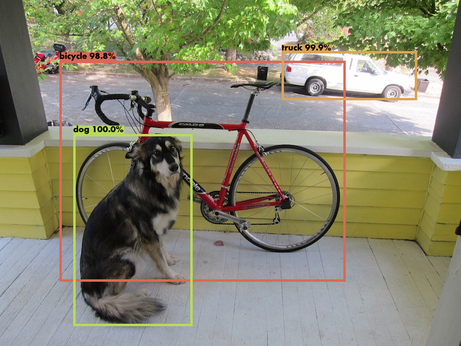

# YOLO-Real-time-object-detection-Computer-Vision
A real time object detection model created in python using YOLO 

Download the weights and add them to the root folder.

Download the yolov3.weights from ths link: 
https://drive.google.com/file/d/1Fn3hgfwKu2czxIyeIFFEURIs2nsOAA_V/view?usp=sharing

Download the yolov3-tiny.weights from ths link: 
https://drive.google.com/file/d/1ftocWWDGEU1TlNlYUt99mIMTtW2D3YMW/view?usp=sharing

